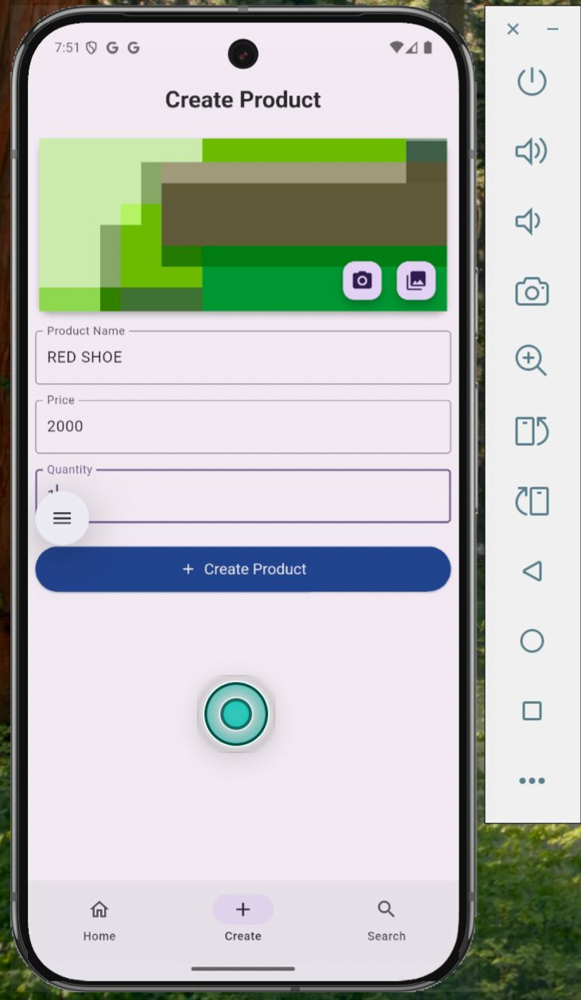
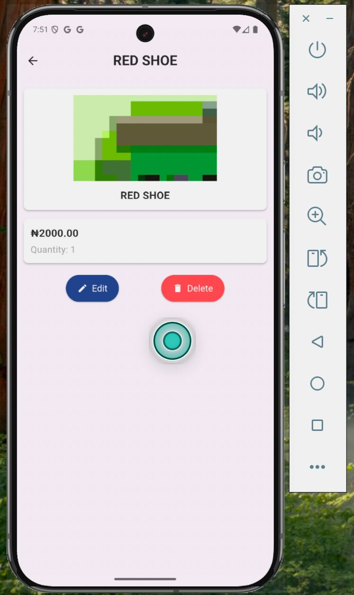
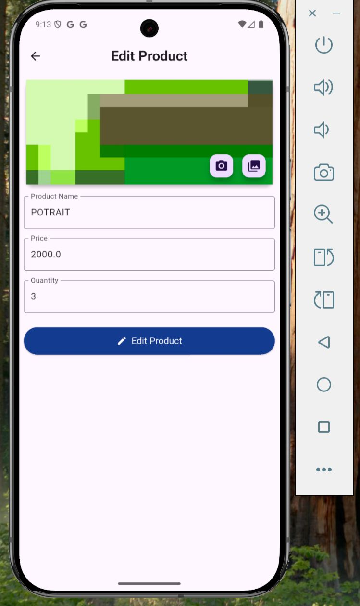
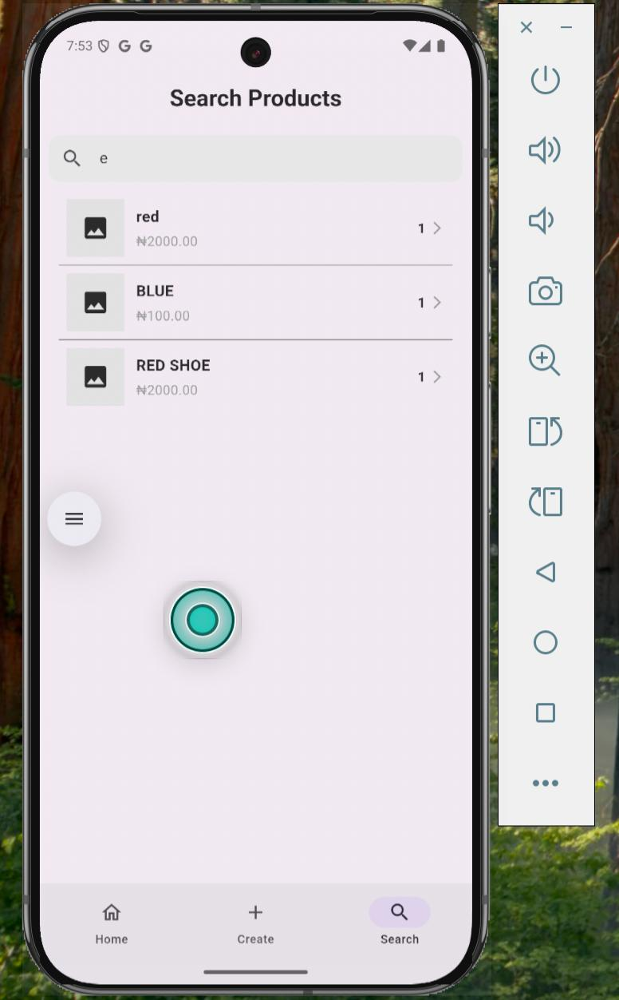
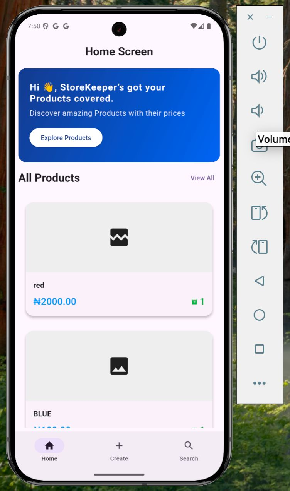
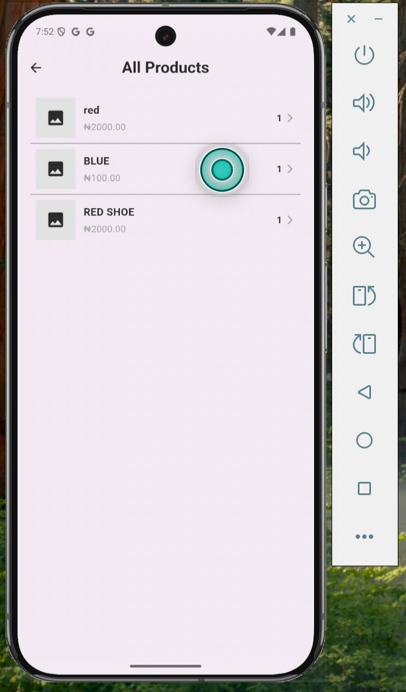

# Store Keeper App

A Flutter-based mobile and web application to manage products in a store. The app allows you to create, edit, and delete products, handle product images, and ensures smooth navigation between screens.

---


## Features

* Add new products with name, price, quantity, and optional image.
* Edit and delete products.
* Automatic generation of unique product IDs.
* Image support for both mobile and web (camera, gallery, file picker).
* Persistent in-memory product list (replaceable with a database).
* Navigation control: back button always navigates to the initial screen.
* Responsive design for mobile and web platforms.
* PopScope usage to handle Android back button behavior properly.

---

## Demo

* **Video Demonstration:**
  Watch the full workflow of the app in action: [Demo Video](https://yourvideolink.com)

---

## Screenshots

*(Replace these with your own app screenshots)*

* **Create Product Screen**
  

* **Product Details Screen**
  

* **Edit Product Screen**
  
* **Search Product Screen**
  

* **Home Details Screen**
  

* **All Product Screen**
  

---

## Deployed App

Try the deployed web version of the app: [Live App Link](https://your-deployed-link.com)

---

## Getting Started

### Prerequisites

* Flutter >= 3.12.0
* Dart >= 3.0.0
* IDE (VS Code, Android Studio) or terminal

### Installation

1. Clone the repository:

```bash
git clone https://github.com/Douglasemmanuel/HNG-13-STAGE-2-MOBILE-DEV.git
```

2. Navigate to the project directory:

```bash
cd store-keeper-app
```

3. Install dependencies:

```bash
flutter pub get
```

4. Run the app:

```bash
flutter run
```

For web:

```bash
flutter run -d chrome
```

---

## Dependencies

* `flutter` – UI framework
* `image_picker` – Pick images from camera/gallery
* `file_picker` – Pick files on web
* `provider` – State management (if using)
* `dart:io`, `dart:typed_data`, `dart:math` – Native utilities

---

## Project Structure

```
lib/
├── main.dart
├── models/
│   └── store_models.dart
├── screens/
│   ├── create_screen.dart
│   └── product_screen.dart
|   |-- edit_screen.dart
|   |-- search_screen.dart
|   |-- all_screen.dart
|   |-- home_screen.dart
├── data/
│   └── products_data.dart
├── providers/
│   └── store_provider.dart
├── utils/
│   └── route_generator.dart
└── widgets/
    └── component/
        └── product_form.dart
```

---

## Usage

1. Open the **Create Product** screen.
2. Fill in product name, price, quantity, and optionally pick an image.
3. Save the product — it will generate a unique ID and store it in memory.
4. View product details on the **Product Screen**.
5. Use the Edit button to modify product details.
6. Use the Delete button to remove a product (navigation will return to initial screen).
7. The back button always returns to the initial screen, preventing navigation to the edit screen.

---

## License

This project is licensed under the MIT License. See the [LICENSE](LICENSE) file for details.

---

